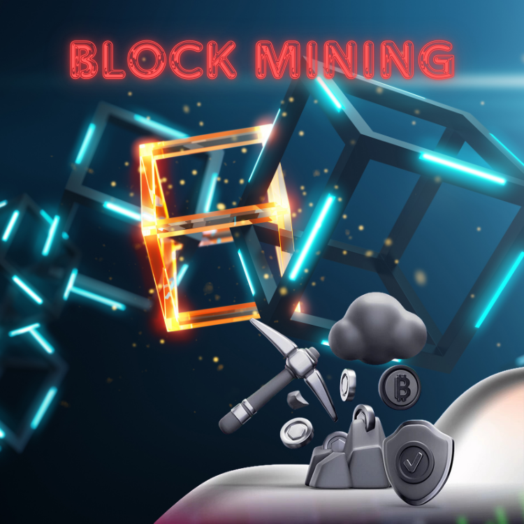

<div align="center">
<br>



</div>

<p align="center">


</p>


<h1 align="center"> Blockchain - Block mining </h1>


<h3 align="center">
<a href="https://github.com/RazikaBengana/holbertonschool-blockchain/tree/main/blockchain/v0.2#eye-about">About</a> •
<a href="https://github.com/RazikaBengana/holbertonschool-blockchain/tree/main/blockchain/v0.2#hammer_and_wrench-tasks">Tasks</a> •
<a href="https://github.com/RazikaBengana/holbertonschool-blockchain/tree/main/blockchain/v0.2#memo-learning-objectives">Learning Objectives</a> •
<a href="https://github.com/RazikaBengana/holbertonschool-blockchain/tree/main/blockchain/v0.2#computer-requirements">Requirements</a> •
<a href="https://github.com/RazikaBengana/holbertonschool-blockchain/tree/main/blockchain/v0.2#keyboard-more-info">More Info</a> •
<a href="https://github.com/RazikaBengana/holbertonschool-blockchain/tree/main/blockchain/v0.2#mag_right-resources">Resources</a> •
<a href="https://github.com/RazikaBengana/holbertonschool-blockchain/tree/main/blockchain/v0.2#bust_in_silhouette-authors">Authors</a> •
<a href="https://github.com/RazikaBengana/holbertonschool-blockchain/tree/main/blockchain/v0.2#octocat-license">License</a>
</h3>

---

<!-- ------------------------------------------------------------------------------------------------- -->

<br>
<br>

## :eye: About

<br>

<div align="center">

**`Blockchain - block mining`** project covers the essential process of **creating new blocks through mining**, **difficulty adjustment**, and **blockchain validation**.
<br>
The programs implement key functionalities such as calculating block hashes, adjusting mining difficulty, verifying proof of work, and managing the blockchain's integrity as new blocks are added.
<br>
<br>
This project has been created by **[Holberton School](https://www.holbertonschool.com/about-holberton)** to enable every student to understand how `block mining` and `consensus mechanisms` in C language work.

</div>

<br>
<br>

<!-- ------------------------------------------------------------------------------------------------- -->

## :hammer_and_wrench: Tasks

<br>

**`0. Proof of work`**

**`1. Block is valid v0.2`**

**`2. Block mining`**

**`3. Adjust difficulty`**

<br>
<br>

<!-- ------------------------------------------------------------------------------------------------- -->

## :memo: Learning objectives

<br>

**_You are expected to be able to [explain to anyone](https://fs.blog/feynman-learning-technique/), without the help of Google:_**

<br>

```diff

General

+ What is the purpose of the Block difficulty

+ What is the Proof of Work

+ How to check that a given hash matches a given difficulty

+ How to mine a Block

+ Why Block mining is brute force only

+ How to automatically adjust the difficulty

```

<br>
<br>

<!-- ------------------------------------------------------------------------------------------------- -->

## :computer: Requirements

<br>

```diff

General

+ Allowed editors: vi, vim, emacs

+ All your files will be compiled on Ubuntu 20.04 LTS

+ Your C programs and functions will be compiled with gcc 9.* using the flags -Wall -Werror -Wextra, -pedantic and the linker flags -lssl and -lcrypto

+ Your library libhblk_crypto.a, located in the crypto folder will be built and linked during correction

+ All your files should end with a new line

+ A README.md file, at the root of the folder of the project, is mandatory

+ Your code should use the Betty style. It will be checked using betty-style.pl and betty-doc.pl

+ The prototypes of all your functions should be included in your header file called blockchain/v0.2/blockchain.h

+ All your header files should be include guarded

```

<br>

**_Why all your files should end with a new line? See [HERE](https://unix.stackexchange.com/questions/18743/whats-the-point-in-adding-a-new-line-to-the-end-of-a-file/18789)_**

<br>
<br>

<!-- ------------------------------------------------------------------------------------------------- -->

## :keyboard: More Info

<br>

### Prerequisites:

<br>

- Create the folder `blockchain/v0.2/` and copy the following files in it:

    - blockchain/v0.1/blockchain_create.c
    - blockchain/v0.1/blockchain_deserialize.c
    - blockchain/v0.1/blockchain_destroy.c
    - blockchain/v0.1/blockchain.h
    - blockchain/v0.1/blockchain_serialize.c
    - blockchain/v0.1/block_create.c
    - blockchain/v0.1/block_destroy.c
    - blockchain/v0.1/block_hash.c
    - blockchain/v0.1/block_is_valid.c

- Modify your code so when a Blockchain is serialized, the version stored is `0.2`

<br>
<br>

### Data structures:

<br>

- Please refer to the [concept page linked to this project](https://drive.google.com/file/d/12t8cLksBCvR8p64CnS6UbLWJomrSgN5h/view?usp=sharing) to get familiar with the different data structures used in this project.

<br>
<br>

### Additional information:

<br>

- Unless specified otherwise, you are allowed to use the `C` standard library

- You are free to use any data structure that suits you as long as their purpose is well defined

- You are free to print any information on `stderr`, this stream will be discarded during correction. <br>
  Since you are going to use these utility functions in your `Blockchain` project, you are free to manage errors as you wish.

- At the end of this project, the structure of your repository should look like this (you may have additional files):

<br>

```yaml
holbertonschool-blockchain
├── blockchain
│   ├── v0.1/
│   └── v0.2
│       ├── blockchain_create.c
│       ├── blockchain_deserialize.c
│       ├── blockchain_destroy.c
│       ├── blockchain_difficulty.c
│       ├── blockchain.h
│       ├── blockchain_serialize.c
│       ├── block_create.c
│       ├── block_destroy.c
│       ├── block_hash.c
│       ├── block_is_valid.c
│       ├── block_mine.c
│       ├── hash_matches_difficulty.c
│       ├── libhblk_blockchain_v0.2.a
│       ├── Makefile
│       ├── provided
│       │   ├── _blockchain_destroy.c
│       │   ├── _blockchain_print.c
│       │   ├── _endianness.c
│       │   ├── endianness.h
│       │   └── _genesis.c
│       └── test
│           ├── blockchain_create-main.c
│           ├── blockchain_deserialize-main.c
│           ├── blockchain_destroy-main.c
│           ├── blockchain_difficulty-main.c
│           ├── blockchain_serialize-main.c
│           ├── block_create-main.c
│           ├── block_destroy-main.c
│           ├── block_hash-main.c
│           ├── block_is_valid-main.c
│           ├── block_mine-main.c
│           └── hash_matches_difficulty-main.c
├── crypto/
└── README.md
```

<br>
<br>

<!-- ------------------------------------------------------------------------------------------------- -->

## :mag_right: Resources

<br>

**_Do you need some help?_**

<br>

**Concepts:**

* **Everything You Need To Know** - Block mining

* [[EYNTK] Blockchain - Block mining](https://drive.google.com/file/d/12t8cLksBCvR8p64CnS6UbLWJomrSgN5h/view?usp=sharing)

<br>

**Read or watch:**

* [Provided libraries and sources](https://github.com/hs-hq/holbertonschool-blockchain)

<br>
<br>

<!-- ------------------------------------------------------------------------------------------------- -->

## :bust_in_silhouette: Authors

<br>

**${\color{blue}Razika \space Bengana}$**

<br>
<br>

<!-- ------------------------------------------------------------------------------------------------- -->

## :octocat: License

<br>

```Blockchain - block mining``` _project has no license specified._

<br>
<br>

---

<p align="center"><br>2024</p>