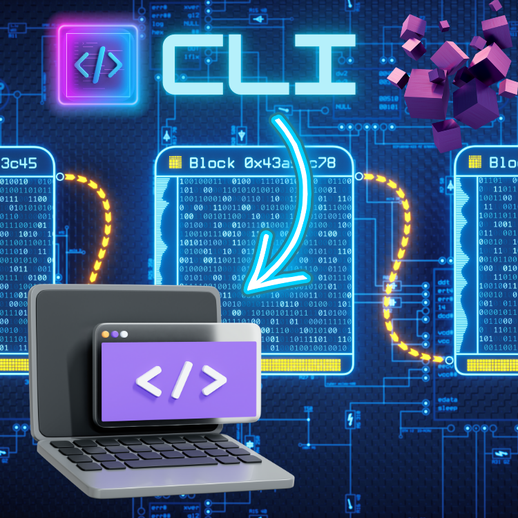

<div align="center">
<br>



</div>

<p align="center">


</p>


<h1 align="center"> Blockchain - CLI </h1>


<h3 align="center">
<a href="https://github.com/RazikaBengana/holbertonschool-blockchain/tree/main/cli#eye-about">About</a> •
<a href="https://github.com/RazikaBengana/holbertonschool-blockchain/tree/main/cli#hammer_and_wrench-tasks">Tasks</a> •
<a href="https://github.com/RazikaBengana/holbertonschool-blockchain/tree/main/cli#memo-learning-objectives">Learning Objectives</a> •
<a href="https://github.com/RazikaBengana/holbertonschool-blockchain/tree/main/cli#computer-requirements">Requirements</a> •
<a href="https://github.com/RazikaBengana/holbertonschool-blockchain/tree/main/cli#package-installation">Installation</a> •
<a href="https://github.com/RazikaBengana/holbertonschool-blockchain/tree/main/cli#keyboard-basic-usage">Basic usage</a> •
<a href="https://github.com/RazikaBengana/holbertonschool-blockchain/tree/main/cli#bust_in_silhouette-authors">Authors</a> •
<a href="https://github.com/RazikaBengana/holbertonschool-blockchain/tree/main/cli#octocat-license">License</a>
</h3>

---

<!-- ------------------------------------------------------------------------------------------------- -->

<br>
<br>

## :eye: About

<br>

<div align="center">

**`Blockchain - CLI`** project is about **creating a comprehensive command-line interface** (`CLI`) for interacting with blockchain and cryptocurrency functionalities, leveraging the `OpenSSL` library for **secure cryptographic operations**.
<br>
The programs implement various commands for wallet management, transaction processing, block mining, and blockchain state manipulation, allowing users to perform operations like loading/saving wallets, sending transactions, and mining blocks, all while ensuring cryptographic integrity.
<br>
<br>
This project has been created by **[Holberton School](https://www.holbertonschool.com/about-holberton)** to enable every student to understand how **blockchain interactions** and **user interfaces** in C language work, providing hands-on experience with both `blockchain concepts` and `secure cryptographic implementations`.

</div>

<br>
<br>

<!-- ------------------------------------------------------------------------------------------------- -->

## :hammer_and_wrench: Tasks

<br>

**`0. CLI - Create/Load Wallet`**

**`1. CLI - Save Wallet`**

**`2. CLI - send`**

**`3. CLI - mine`**

**`4. CLI - info`**

**`5. CLI - load`**

**`6. CLI - save`**

<br>
<br>

<!-- ------------------------------------------------------------------------------------------------- -->

## :memo: Learning objectives

<br>

**_You are expected to be able to [explain to anyone](https://fs.blog/feynman-learning-technique/), without the help of Google:_**

<br>

```diff

General

+ How to interact with the Blockchain library you previously created

+ How to maintain a transaction pool

```

<br>
<br>

<!-- ------------------------------------------------------------------------------------------------- -->

## :computer: Requirements

<br>

```diff

General

+ Allowed editors: vi, vim, emacs

+ All your files will be compiled on Ubuntu 20.04 LTS

+ Your C programs and functions will be compiled with gcc 9.* using the flags -Wall -Werror -Wextra, -pedantic and the linker flags -lssl and -lcrypto

+ Your library libhblk_crypto.a, located in the crypto folder will be built and linked during correction

+ Your library libhblk_blockchain.a, located in the blockchain/v0.3 folder will be built and linked during correction

+ All your files should end with a new line

+ A README.md file, at the root of the folder of the project, is mandatory

+ Your code should use the Betty style. It will be checked using betty-style.pl and betty-doc.pl

+ The prototypes of all your functions should be included in your header file called blockchain/v0.2/blockchain.h

+ All your header files should be include guarded


Folder & Compilation

+ The sources of your CLI must be placed in the folder cli, at the root of your repository. This folder should contain a Makefile, that creates the program cli.

+ You are free to use any library call of your choice.

+ You are free to design and arrange your code the way you like, as long as it is Betty-compliant.


Program

+ The CLI is a really simple command interpreter, that will allow a user to interact with your Blockchain API

+ The goal is to implement a simple command line interface, in C

+ You are free to design your CLI the way you like

+ You are free to output the information in the format of your choice, as long as the requirements are fulfilled

```

<br>

**_Why all your files should end with a new line? See [HERE](https://unix.stackexchange.com/questions/18743/whats-the-point-in-adding-a-new-line-to-the-end-of-a-file/18789)_**

<br>
<br>

<!-- ------------------------------------------------------------------------------------------------- -->

## :package: Installation

<br>

- [GCC](https://gcc.gnu.org/) (see [`gcc(1)`](https://www.man7.org/linux/man-pages/man1/gcc.1.html) for details)

- [make](https://www.gnu.org/software/make/) (see [`make(1)`](https://man7.org/linux/man-pages/man1/make.1.html) for details)

- [OpenSSL](https://www.openssl.org/) shared library

- [pthreads](https://en.wikipedia.org/wiki/Pthreads) shared library (see [`pthreads(7)`](https://man7.org/linux/man-pages/man7/pthreads.7.html) for details)

<br>
<br>

:pushpin: **Note**:
<br>
<br>
For details on installing the above dependencies, defer to your **distro's package manager**.

<br>
<br>

### Build instructions:

<br>
<br>

:white_check_mark: **Install the `llist` shared library**:

<br>

- To install the `llist` shared library from the [`llist`](llist/) directory, execute the following commands from the root of the repository:

<br>

```yaml
cd llist
sudo ./install.sh
```

<br>

:pushpin: **Note**:
<br>
<br>
The `llist` shared library can be uninstalled by running [`uninstall.sh`](llist/uninstall.sh) from the [`llist`](llist/) directory.

<br>
<br>

:white_check_mark: **Build the `libhblk_crypto` static library**:

<br>

- To make the `libhblk_crypto` static library from the [`crypto`](crypto/) directory, execute the following commands from the root of the repository:

<br>

```yaml
cd crypto
make
```

<br>
<br>

:white_check_mark: **Build the `libhblk_blockhain` static library (version `0.3`)**:

<br>

- To make the `libhblk_blockhain` static library from the [`blockchain/v0.3`](blockchain/v0.3/) directory, execute the following commands from the root of the repository:

<br>

```yaml
cd blockchain/v0.3
make
```

<br>
<br>

:white_check_mark: **Build the `cli` executable**:

<br>

- To make the `libhblk_blockhain` static library from the [`blockchain/v0.3`](blockchain/v0.3/) directory, execute the following commands from the root of the repository:

<br>

```yaml
cd cli
make
```

<br>
<br>

<!-- ------------------------------------------------------------------------------------------------- -->

## :keyboard: Basic Usage

<br>

- The `CLI` may be used to interact with the blockchain. <br>
  To run the `CLI`, execute the following command from the root of the repository:

<br>

```yaml
cli/cli
```

<br>
<br>

- If execution fails with an error message indicating that the `libllist` library cannot be found, temporarily add `/usr/local/lib` to the linker's search paths by running the `CLI` from the root of the repository with the following command:

<br>

```sh
LD_LIBRARY_PATH="${LD_LIBRARY_PATH:+${LD_LIBRARY_PATH}}:/usr/local/lib" cli/cli
```

<br>
<br>

### Commands:

<br>
<br>

- The following commands are available in the `CLI`:

<br>

| Command     | Usage                 | Description                                     |
| ----------- | --------------------- | ----------------------------------------------- |
| exit        | `exit`                | Exit.                                           |
| help        | `help [COMMAND]`      | Display information about available commands.   |
| info        | `info`                | Display information about the local blockchain. |
| load        | `load PATH`           | Load blockchain from a file.                    |
| mine        | `mine`                | Mine a block.                                   |
| save        | `save PATH`           | Save blockchain to a file.                      |
| send        | `send AMOUNT ADDRESS` | Send coins.                                     |
| wallet_load | `wallet_load PATH`    | Load wallet from a file.                        |
| wallet_save | `wallet_save PATH`    | Save wallet to a file.                          |

<br>
<br>

<!-- ------------------------------------------------------------------------------------------------- -->

## :bust_in_silhouette: Authors

<br>

**${\color{blue}Razika \space Bengana}$**

<br>
<br>

<!-- ------------------------------------------------------------------------------------------------- -->

## :octocat: License

<br>

```Blockchain - CLI``` _project has no license specified._

<br>
<br>

---

<p align="center"><br>2024</p>